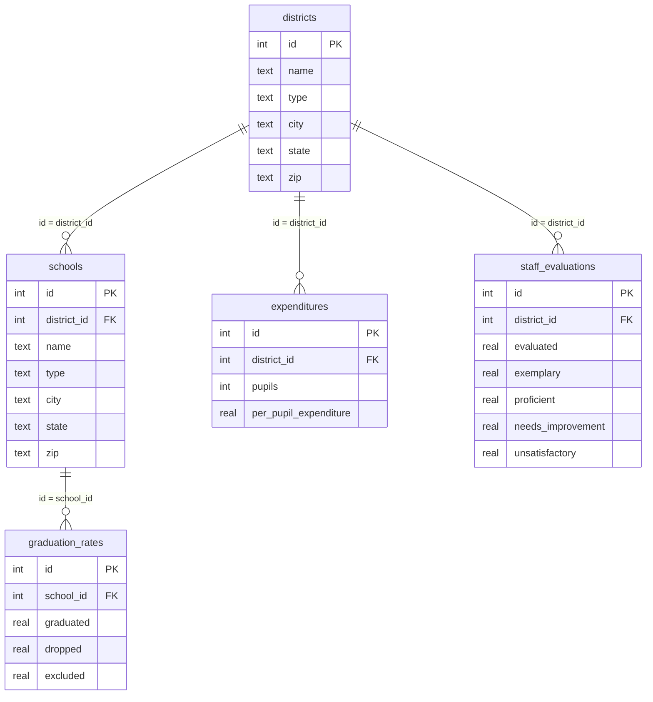
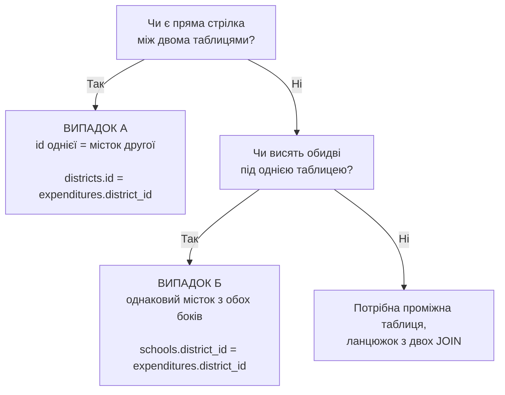
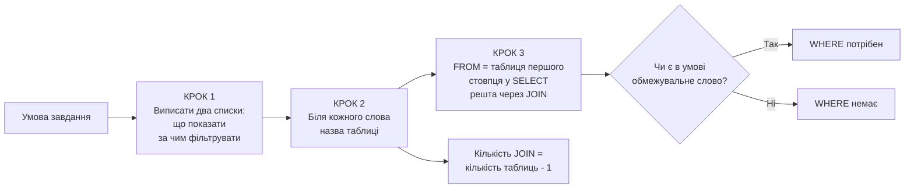
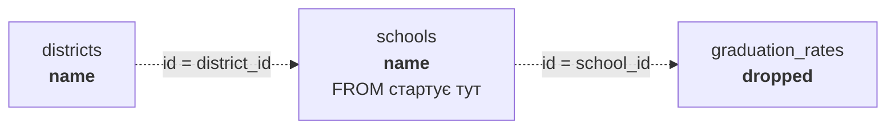
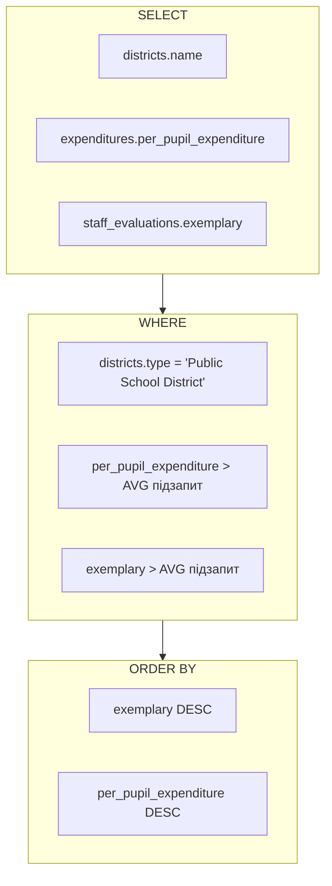

# Схеми до week 1 (Relating)

Візуальний додаток до `joins-and-subqueries.sql`.
Діаграми у форматі Mermaid, GitHub рендерить їх автоматично.

---

## 1. Карта містків dese.db

Стрілка це місток. Тільки через містки таблиці можна склеїти.

Читати так: `districts` угорі, під нею три таблиці. Під `schools` ще одна.

---

## 2. Два випадки для ON

Випадок Б був у 11.sql. Прямої стрілки між `schools` і `expenditures`
немає, але обидві висять під `districts`. Сама `districts` при цьому
в запиті не потрібна.

---

## 3. Метод трьох кроків

Обмежувальні слова: державні, чартерні, з назвою X, які повідомили 100%,
3 і менше, більше за середнє.

**ORDER BY і LIMIT не є фільтром.** "10 найдорожчих" це `ORDER BY` плюс
`LIMIT`, а не `WHERE`.

---

## 4. Ланцюжок з трьох таблиць

Приклад: назва школи, назва округу, відсоток тих, хто кинув навчання.

`schools` стоїть посередині ланцюжка, обидві стрілки виходять з неї,
тому саме вона йде у `FROM`, а решта чіпляється по боках.

---

## 5. Що звідки береться у 12.sql

Найважчий запит pset: три таблиці плюс два підзапити.

Пастка: середнє в підзапиті рахується по **всій** таблиці,
без фільтра по типу округу. Тобто всередині підзапиту немає `WHERE`.
Якщо додати туди фільтр, запит виконається без помилки,
але поверне іншу кількість рядків.
